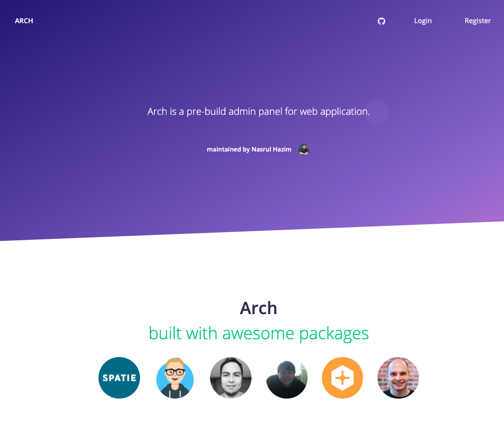
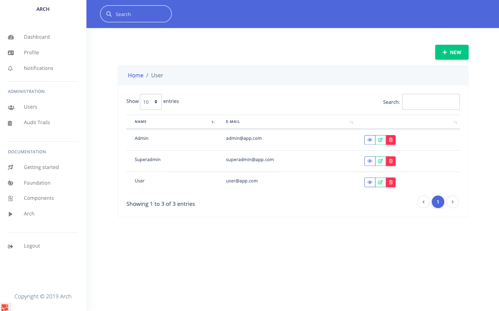

[](https://circleci.com/gh/nasrulhazim/arch)

## Arch 





## Table of Content

* [Version Compatibility](#version-compatibility)
* [Quick Installation](#quick-installation)
* [Contributing to the Arch](#contributing-to-the-arch)
* [Security](#security-vulnerabilities)
* [License](#license)

## Version Compatibility

Laravel    | Arch
:----------|:----------
 5.8.x     | 1.1.x
 6.x       | 2.x 
 7.x 	   | 3.x

## Quick Installation

```
$ composer create-project nasrulhazim/arch project-name --prefer-dist
```

Navigate to `project-name` and duplicate `.env.example` to `.env`. Update your configuration then run the following command:

```
$ bin/install
```

This will install all the Arch dependencies - backend and frontend, and also setup migration & seeders.

## Development

Following are the commands available for your development:

#### Bash Scripts

Arch come with numbers of bash scripts, to simplify development tasks. This scripts only works in Linux environment:

Following are the available bash scripts: 

1. `bin/changelog` - Create changelog file based on give date range.
2. `bin/clear-cache` - Clear all related caches available in the Arch.
3. `bin/csfix` - Apply PHP CS Fixer and commit.
4. `bin/install` - Install Arch.
5. `bin/reload-db` - Recache & reload database.
6. `bin/serve` - Setup Valet link, secure the domain and open the domain.
7. `bin/update-dependencies` - Run `composer update` and commit if any changes.

#### Arch Page 

Is a command create necessary model, migration, factory, seeder, controller for web and API, setting up routes for API, web, datatable and breadcrumb and create all main views - index, show, create, edit and partis/actions.

You just need to run following command to create a page.

You may want to check and update generated files to meet the common practice.

```
$ php artisan arch:page Module
```

#### Reload All Caches

```
$ php artisan reload:cache
```

#### Reload Database and Seed

```
$ php artisan reload:db
```

#### Seed Development Data

```
$ php artisan seed:dev
```

#### Create Transformer Class

```
$ php artisan make:transformer UserTransformer Models\\User
```

#### Create Datatable Class

```
$ php artisan make:dt UserDt Models\\User Datatable\\UserTransformer
```

## Contributing to the Arch

Contributions can be made to the Arch's respective component repositories:

- [Blade Plus Plus](https://github.com/cleaniquecoders/blade-plus-plus)
- [Blueprint Macro](https://github.com/cleaniquecoders/blueprint-macro)
- [Profile](https://github.com/cleaniquecoders/profile)
- [Laravel Helper](https://github.com/cleaniquecoders/laravel-helper)
- [Laravel Observers](https://github.com/cleaniquecoders/laravel-observers)

## Security Vulnerabilities

If you discover a security vulnerability within Arch, please send an e-mail to nasrulhazim.m@gmail.com. All security vulnerabilities will be promptly addressed.

## License

* The Laravel PHP Framework is open-sourced software licensed under the [MIT license](http://opensource.org/licenses/MIT) by [Taylor Otwell](https://github.com/taylorotwell).
* The Arch is open-sourced software licensed under the [MIT license](http://opensource.org/licenses/MIT).
